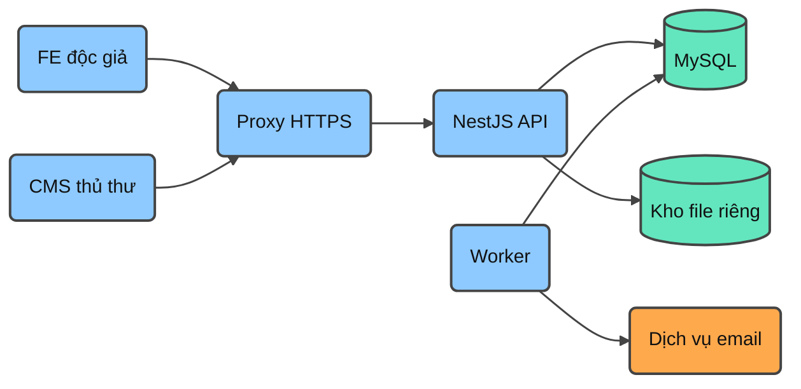
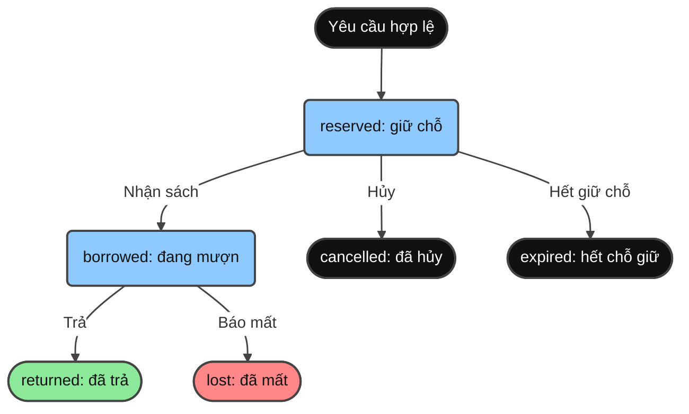

# Sơ đồ kiến trúc BE

Sơ đồ minh họa thiết kế, không thể hiện thành phần đã triển khai. Mermaid dùng strict mode, không callback hoặc nguồn ảnh ngoài. Trạng thái kiểm tra: **syntax-reviewed**, chưa parse/render bằng runtime Mermaid trong task này.

## 1. Thành phần chính

Màu xanh dương là thành phần ứng dụng; xanh ngọc là nơi lưu dữ liệu; cam là dịch vụ email. API và worker dùng chung codebase, giao việc gửi mail qua MySQL outbox. Worker xử lý file nếu được bật sẽ cần cùng quyền đọc vùng quarantine.

## 2. Một phiếu mượn

Xanh dương là trạng thái giữ bản sách; xanh lá là đã trả; đỏ là mất; nền đen là đầu vào hoặc kết thúc khác. `overdue` là điều kiện thời gian của borrowed. Mất sách đồng thời chuyển condition copy sang lost để copy không quay lại tồn khả dụng.

Chi tiết khóa, quyền và transaction nằm trong [business flows](06-business-flows.md). Quan hệ bảng xem [sơ đồ database gốc](../../planning/database/schema-diagrams.md).
