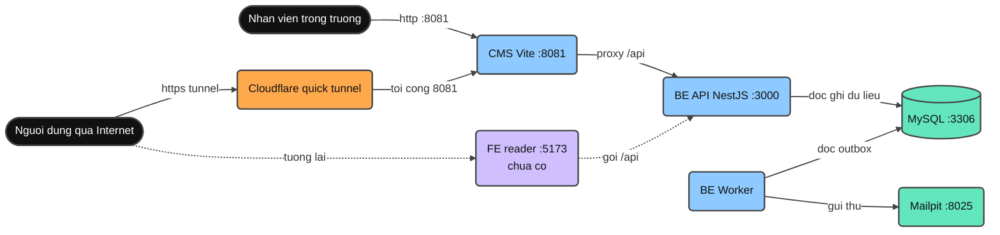
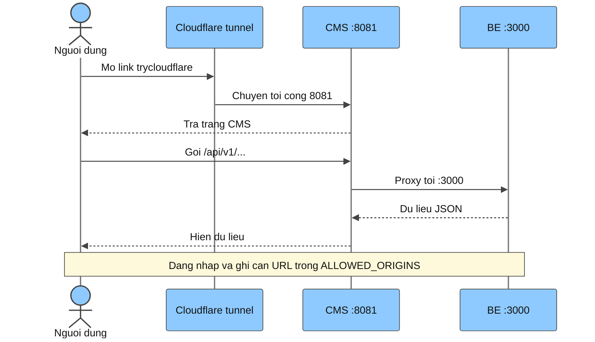

# Hướng dẫn dev hàng ngày (Quan-Ly-Sach)

Tài liệu này giúp bạn tự chạy dự án mỗi ngày: bật và dừng từng phần (BE, CMS, FE),
lấy link công khai qua Cloudflare tunnel, và tạo hoặc đăng nhập tài khoản. Mọi lệnh
chạy từ thư mục gốc repo bằng `make`.

Các phần trong dự án:

- BE: backend API NestJS và worker gửi mail, dùng MySQL. Chạy ở cổng 3000.
- CMS: giao diện thủ thư (React + Vite). Chạy ở cổng 8081.
- FE: giao diện độc giả. Chưa triển khai (theo kế hoạch CMS-11), thư mục `FE/` còn trống.
- Hạ tầng: MySQL 3306 và Mailpit 8025 chạy trong Docker.

## make là gì và vì sao dùng

`make` là công cụ chạy lệnh có sẵn trên macOS. Nó đọc file `Makefile` ở thư mục gốc repo,
nơi mỗi "mục tiêu" (target) là một lệnh ngắn gói sẵn nhiều câu lệnh dài bên trong. Thay vì
nhớ và gõ cả chuỗi lệnh dài, bạn chỉ gõ `make <tên-lệnh>`.

Lợi ích:

- Ngắn và dễ nhớ: `make dev` thay cho nhiều câu lệnh Docker và npm.
- Thống nhất cả nhóm: mọi người chạy cùng một lệnh, ít sai sót.
- Tự tài liệu: gõ `make` hoặc `make help` để xem danh sách lệnh.

Ví dụ, `make dev` thực chất chạy ba việc:

1. Bảo đảm Docker đang chạy (tự mở Docker Desktop nếu cần) rồi bật MySQL + Mailpit
   (`docker compose up -d --wait`).
2. Chạy BE (`nest start --watch`) và CMS (`vite`) cùng lúc, gộp log chung có tiền tố
   `[BE]` và `[CMS]`.
3. Nhấn `Ctrl-C` một lần để tắt cả hai.

Xem định nghĩa chi tiết trong file `Makefile` ở gốc repo.

## 1. Chuẩn bị một lần

1. Bật Docker Desktop (chỉ cần cài và mở; script sẽ tự mở khi cần).
2. Cài công cụ tunnel: `brew install cloudflared`.
3. Tạo file môi trường (chỉ làm lần đầu, nếu chưa có):

```sh
cp BE/docker/.env.docker.example BE/docker/.env.docker
cp BE/.env.example BE/.env
```

Lưu ý: `DATABASE_PASSWORD` trong `BE/.env` phải khớp `MYSQL_APP_PASSWORD` trong
`BE/docker/.env.docker` (mặc định `local-app-change-me`).

## 2. Bật nhanh mỗi ngày

Cách đơn giản nhất, chạy cả BE và CMS trong một lệnh:

```sh
make dev
```

Lệnh này tự bật Docker (MySQL + Mailpit), rồi chạy BE và CMS cùng lúc, gộp log chung.
Nhấn `Ctrl-C` để tắt cả hai. Sau khi chạy, mở trình duyệt:

- CMS: http://localhost:8081  (sẽ tự chuyển tới trang đăng nhập)
- Mailpit (xem mail thử): http://127.0.0.1:8025

Muốn chạy kèm worker (cần cho gửi mail kích hoạt và quên mật khẩu):

```sh
make dev-all
```

## 3. Bật từng phần

Mở mỗi phần trong một terminal riêng nếu muốn tách biệt:

| Lệnh | Chạy gì | Cổng |
| --- | --- | --- |
| `make db-up` | MySQL + Mailpit (Docker) | 3306, 8025 |
| `make be` | BE API (tự bật DB trước) | 3000 |
| `make worker` | BE worker gửi mail | - |
| `make cms` | CMS (Vite dev) | 8081 |
| `make fe` | FE dev (báo "chưa có" vì FE chưa triển khai) | 5173 |

## 4. Dừng khi cần

| Cách | Tác dụng |
| --- | --- |
| `Ctrl-C` | Tắt các dịch vụ đang chạy trong terminal đó |
| `make stop` | Tắt BE, worker, CMS, tunnel (Docker vẫn chạy) |
| `make db-down` | Tắt Docker MySQL + Mailpit (giữ dữ liệu) |
| `make db-reset` | Tắt và xóa dữ liệu MySQL (hỏi xác nhận) |

## 5. Lấy link công khai (Cloudflare tunnel)

Tunnel cho phép chia sẻ giao diện ra Internet qua một URL tạm
`https://<ngau-nhien>.trycloudflare.com`. Cần hai terminal chạy cùng lúc:

```sh
# Terminal 1: chạy ứng dụng
make dev

# Terminal 2: mở tunnel tới CMS
make tunnel-cms
```

Terminal 2 sẽ in ra URL. Mở đúng URL đó. Các điểm quan trọng:

- Giữ terminal 2 mở suốt thời gian dùng. URL chỉ sống khi tiến trình cloudflared còn
  chạy. Đóng terminal là URL chết (trình duyệt báo `DNS_PROBE` hoặc không tìm thấy DNS).
- Mỗi lần chạy lại `make tunnel-cms` là một URL mới. Dùng URL cũ sẽ không vào được.
- Muốn tunnel tới cổng khác: `make tunnel PORT=1234`.

### Đăng nhập qua tunnel

Xem và tra cứu qua tunnel chạy được ngay. Nhưng đăng nhập và các thao tác ghi
(thêm, sửa, xóa) sẽ bị lỗi 403 cho tới khi bạn thêm URL tunnel vào danh sách cho phép:

1. Copy URL `https://<ngau-nhien>.trycloudflare.com` mà `make tunnel-cms` in ra.
2. Mở `BE/.env`, tìm dòng `ALLOWED_ORIGINS=` và thêm URL đó vào cuối, cách nhau bằng dấu phẩy.
3. Khởi động lại BE (`Ctrl-C` rồi `make be`, hoặc chạy lại `make dev`).

Lý do: BE có guard chỉ chấp nhận yêu cầu ghi từ các `Origin` nằm trong `ALLOWED_ORIGINS`
(quy tắc D03).

## 6. Tài khoản đăng nhập

### Tài khoản admin có sẵn (local dev)

Đã có sẵn một tài khoản quản trị để đăng nhập CMS:

| Trường | Giá trị |
| --- | --- |
| Email | admin@local.test |
| Mật khẩu | Admin@Local2026 |

Lưu ý: mật khẩu admin đã được đặt lại ngày 2026-09-22 về giá trị trên. Nếu trước đây
nhóm từng đặt một giá trị dev khác, giá trị cũ không còn dùng được nữa. Chỉ dùng cho
local dev. Mở http://localhost:8081 và đăng nhập.

Đổi mật khẩu: dùng chức năng "Quên mật khẩu" ở trang đăng nhập; email đặt lại tới Mailpit
(cần worker chạy).

### Tạo admin đầu tiên (khi chưa có admin nào)

Nếu database mới tinh (chưa có admin), tạo admin đầu tiên:

```sh
make create-admin
```

Lệnh sẽ hỏi email và mật khẩu (ít nhất 12 ký tự). Nếu đã có admin, lệnh báo
`created:false` và không tạo thêm (đây là cơ chế bootstrap một lần).

### Thêm người dùng khác

Bootstrap chỉ tạo admin đầu tiên. Người dùng khác tạo theo luồng ứng dụng:

1. Đăng nhập bằng admin, vào CMS tạo người dùng mới (trạng thái `invited`).
2. Hệ thống gửi email kích hoạt vào Mailpit (http://127.0.0.1:8025).
3. Người được mời mở link trong email để đặt mật khẩu và kích hoạt.

Luồng này cần worker chạy (`make worker` hoặc `make dev-all`).

### Quên mật khẩu

Dùng chức năng "Quên mật khẩu" trên trang đăng nhập. Email đặt lại sẽ tới Mailpit;
mở link trong đó để đặt mật khẩu mới. Cũng cần worker chạy.

## 7. Sơ đồ kết nối

### Các thành phần nối với nhau thế nào



Chú thích màu: đen là người dùng; xanh dương là dịch vụ ứng dụng (CMS, BE, worker);
cam là bên thứ ba (Cloudflare); xanh lá là kho dữ liệu và mail; tím nét đứt là phần
chưa làm (FE).

Tóm tắt: người dùng trong trường vào CMS trực tiếp qua cổng 8081; người ngoài vào qua
Cloudflare tunnel; CMS gọi API sang BE; BE lưu vào MySQL; worker đọc hàng chờ để gửi mail.

### Một yêu cầu qua link công khai đi thế nào



Tóm tắt: trình duyệt chỉ nói tới Cloudflare; Cloudflare chuyển về máy của bạn; CMS lấy
dữ liệu từ BE thay cho trình duyệt. Vì vậy chỉ cần mở tunnel tới CMS, không cần tunnel
riêng cho BE.

## 8. Xử lý sự cố thường gặp

| Triệu chứng | Nguyên nhân | Cách xử lý |
| --- | --- | --- |
| BE báo `ECONNREFUSED 127.0.0.1:3306` | Docker/MySQL chưa chạy | `make db-up` (hoặc `make be` sẽ tự bật) |
| Link tunnel báo `DNS_PROBE` / không thấy DNS | Tunnel đã đóng | Chạy lại `make tunnel-cms`, dùng URL mới, giữ terminal mở |
| Tunnel log `Unauthorized: Tunnel not found` | Lỗi tạm thời phía Cloudflare | Tắt và chạy lại `make tunnel-cms` để lấy tunnel mới |
| Đăng nhập qua tunnel bị 403 | URL chưa có trong `ALLOWED_ORIGINS` | Xem mục 5, thêm URL vào `BE/.env` rồi khởi động lại BE |
| `make create-admin` báo `created:false` | Đã có admin rồi | Đăng nhập bằng admin có sẵn (mục 6) |

## 9. Cổng mặc định

| Dịch vụ | Cổng | Ghi chú |
| --- | --- | --- |
| BE API | 3000 | REST dưới `/api/v1` |
| CMS (Vite) | 8081 | Giao diện thủ thư |
| MySQL | 3306 | Trong Docker |
| Mailpit UI | 8025 | http://127.0.0.1:8025 |
| FE | 5173 | Mặc định, chưa triển khai |

Xem thêm chi tiết script trong `scripts/README.md`.
