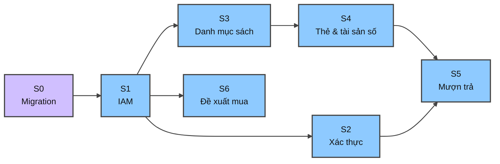
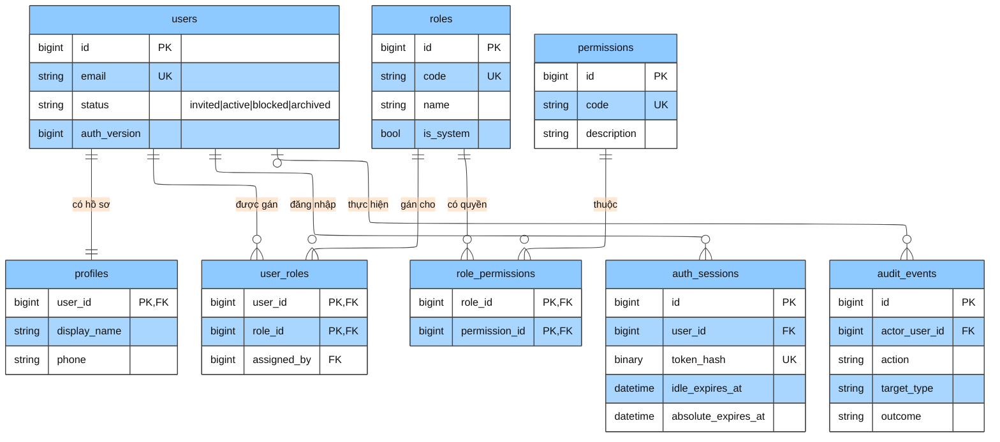
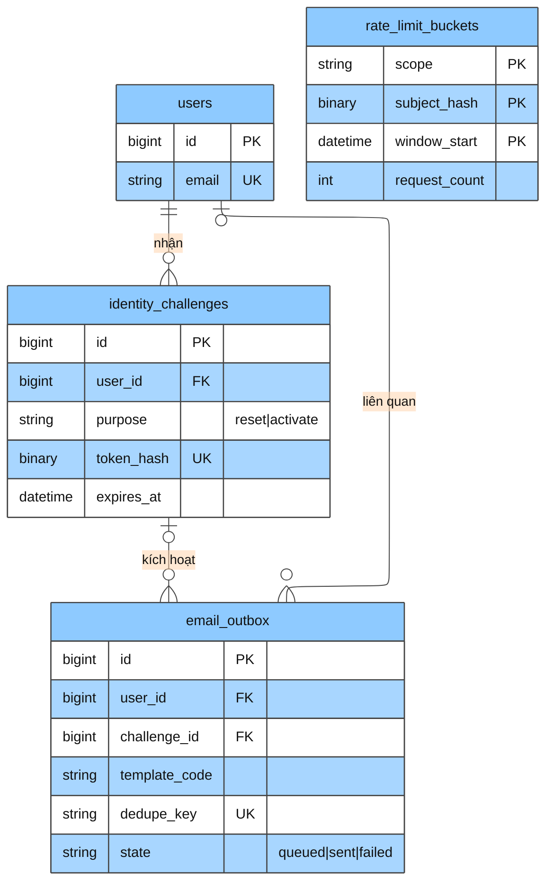
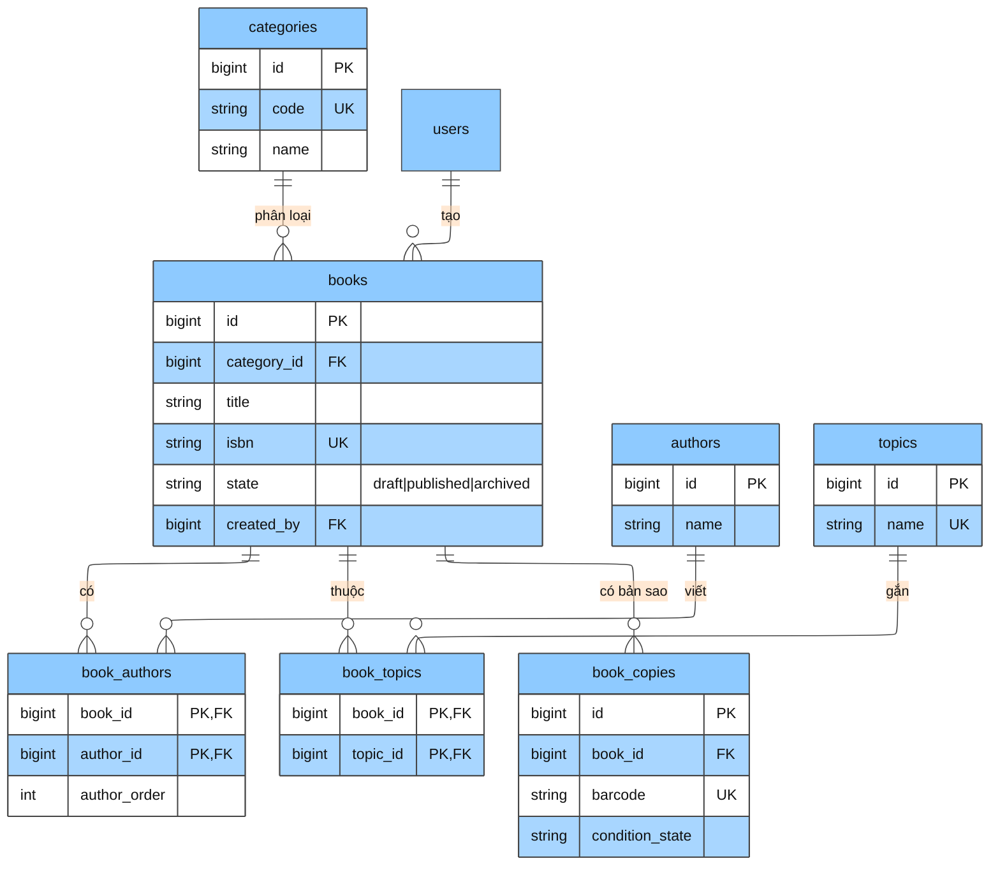
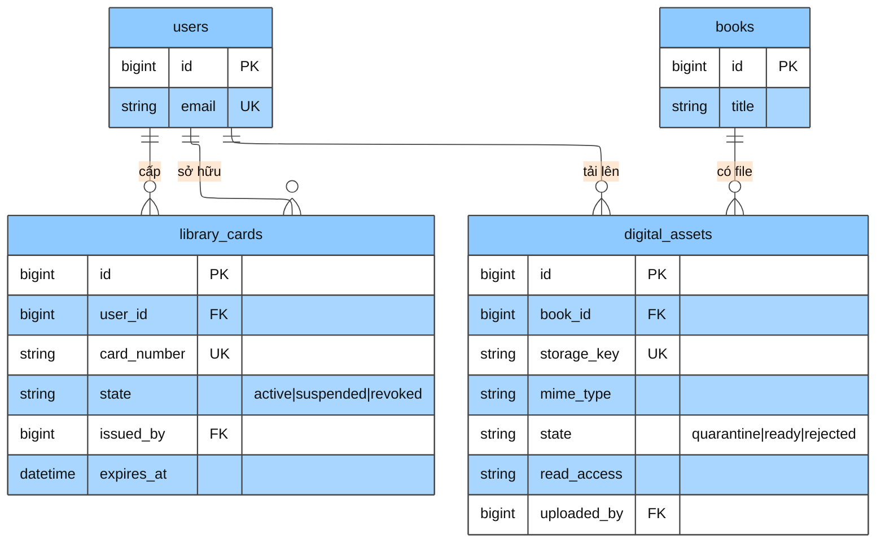
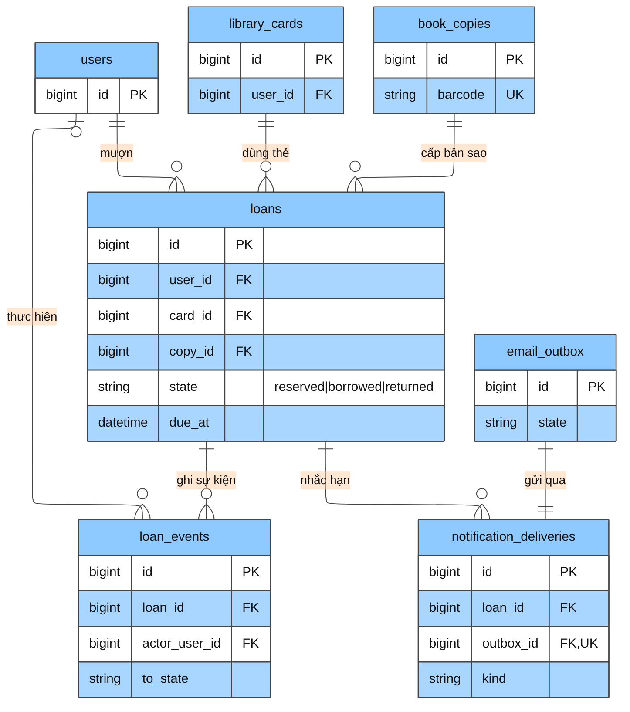
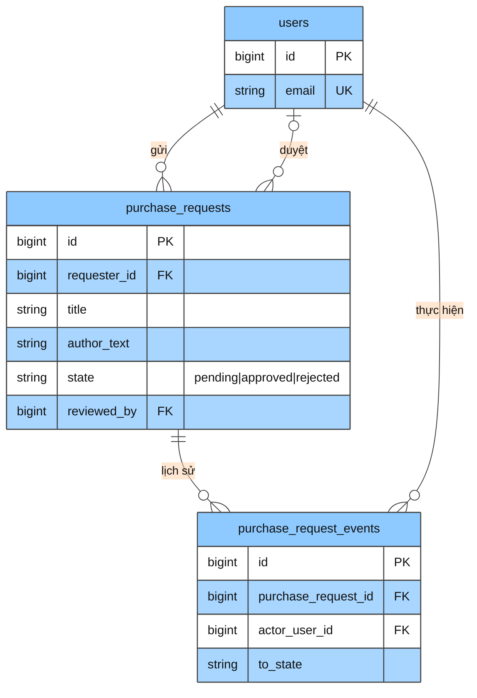

# Sơ đồ cơ sở dữ liệu

Bản thiết kế trực quan cho [`schema.sql`](schema.sql). Mục tiêu: MySQL 8.4 / InnoDB. Ứng dụng dùng UTC; API trả `BIGINT` dạng chuỗi.

**Trạng thái:** bản nháp thiết kế, chưa chạy migration.

---

## Tổng quan module

**Tóm tắt:** `users` là trung tâm định danh. `books` và `book_copies` tách phiên bản sách khỏi bản sao vật lý. `loans` gắn thẻ thư viện, bản sao và vòng đời mượn trả.

---

## Chú thích màu (Vivid Clay)

| Vai trò | Màu | Ý nghĩa trong ER |
| ------- | --- | ---------------- |
| Nền chính | Xanh da trời `#8ECAFF` | Hộp thực thể |
| Viền | Xám đậm `#444444` | Quan hệ và khung |
| Chữ | Đen `#111111` | Nhãn và thuộc tính |

---

## S0: Lịch sử migration

Bảng `schema_migrations` do runner quản lý trước migration ứng dụng. Không có khóa ngoại.

| Cột chính | Ý nghĩa |
| --------- | ------- |
| `version` PK | Phiên bản migration |
| `state` | `running`, `applied`, `failed`, `rolled_back` |
| `direction` | `up` hoặc `down` |

---

## S1: Định danh và phân quyền (IAM)

**Tóm tắt:** Một `users` có tối đa một `profiles`. Vai trò và quyền nối qua bảng nối `user_roles` và `role_permissions`. `auth_sessions` lưu hash token, không lưu cookie thô.

**Ghi chú:** `iam_policy_locks` là khóa singleton (`id = 1`) dùng khi khóa/block/archive admin; không có FK.

---

## S2: Thử thách xác thực và email

**Tóm tắt:** `identity_challenges` phục vụ đặt lại mật khẩu và kích hoạt tài khoản. `email_outbox` hàng đợi gửi email bền vững. `rate_limit_buckets` độc lập, không FK.

---

## S3: Danh mục sách

**Tóm tắt:** `books` là phiên bản/đầu mục sách; `book_copies` là bản sao vật lý có barcode riêng. Tác giả và chủ đề gắn qua bảng nối.

---

## S4: Thẻ thư viện và tài sản số

**Tóm tắt:** Mỗi thành viên có thể có nhiều thẻ nhưng chỉ một thẻ `active` (ràng buộc unique trên cột ảo `active_user_id`). `digital_assets` lưu metadata file số, không lưu nội dung thô trong DB.

---

## S5: Mượn trả và thông báo

**Tóm tắt:** `loans` gắn `(card_id, user_id)` composite FK với `library_cards`. Một bản sao chỉ có một loan đang active (`reserved` hoặc `borrowed`) nhờ cột ảo `active_copy_id`. Thông báo đến hạn đi qua `email_outbox`.

---

## S6: Đề xuất mua sách

**Tóm tắt:** Đây là yêu cầu mua sách (acquisition), không phải giao dịch thanh toán. Mọi chuyển trạng thái được ghi trong `purchase_request_events`.

---

## Bảng độc lập (không FK)

| Bảng | Module | Vai trò |
| ---- | ------ | ------- |
| `schema_migrations` | S0 | Theo dõi migration đã chạy |
| `iam_policy_locks` | S1 | Khóa singleton cho thao tác IAM nhạy cảm |
| `rate_limit_buckets` | S2 | Giới hạn tần suất theo scope và subject hash |

---

## Danh sách bảng (27)

| # | Bảng | Module |
| - | ---- | ------ |
| 1 | `schema_migrations` | S0 |
| 2 | `users` | S1 |
| 3 | `profiles` | S1 |
| 4 | `roles` | S1 |
| 5 | `permissions` | S1 |
| 6 | `user_roles` | S1 |
| 7 | `role_permissions` | S1 |
| 8 | `auth_sessions` | S1 |
| 9 | `iam_policy_locks` | S1 |
| 10 | `audit_events` | S1 |
| 11 | `identity_challenges` | S2 |
| 12 | `rate_limit_buckets` | S2 |
| 13 | `email_outbox` | S2 |
| 14 | `categories` | S3 |
| 15 | `authors` | S3 |
| 16 | `topics` | S3 |
| 17 | `books` | S3 |
| 18 | `book_authors` | S3 |
| 19 | `book_topics` | S3 |
| 20 | `book_copies` | S3 |
| 21 | `library_cards` | S4 |
| 22 | `digital_assets` | S4 |
| 23 | `loans` | S5 |
| 24 | `loan_events` | S5 |
| 25 | `notification_deliveries` | S5 |
| 26 | `purchase_requests` | S6 |
| 27 | `purchase_request_events` | S6 |

---

## Cách xem sơ đồ

- **GitHub / GitLab:** mở file này trên web; renderer hỗ trợ Mermaid 9.4+.
- **VS Code / Cursor:** cài extension "Markdown Preview Mermaid Support".
- **Trực tuyến:** dán từng khối mermaid vào [mermaid.live](https://mermaid.live).

Trạng thái kiểm tra: **syntax-reviewed** (chưa render trực quan trong phiên này).
